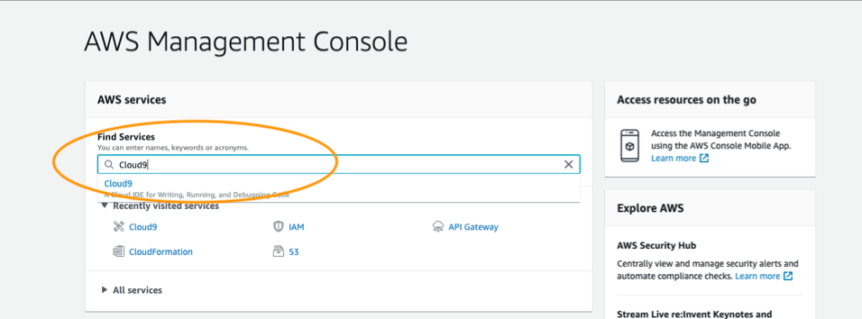
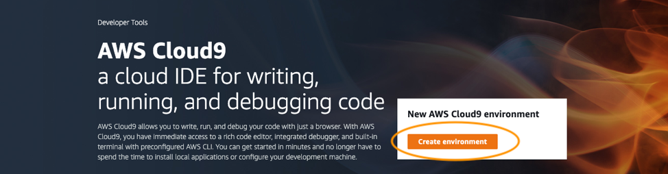
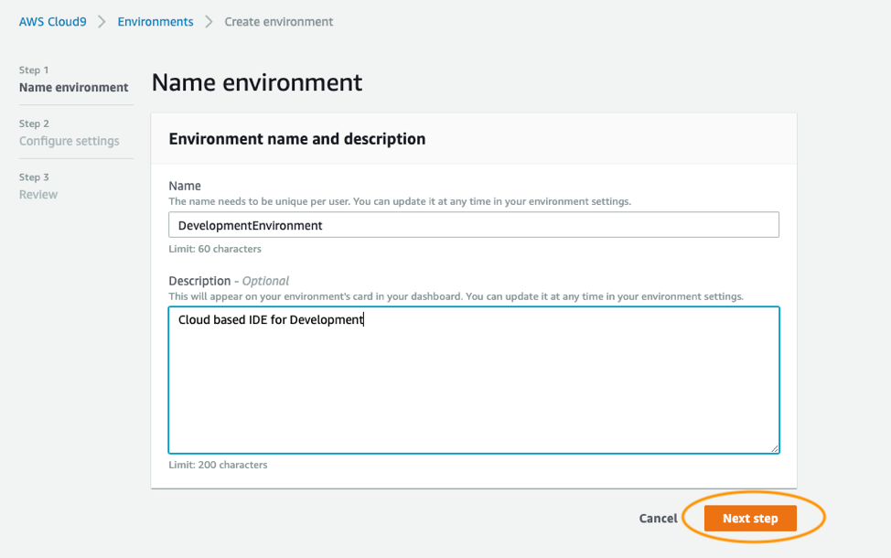
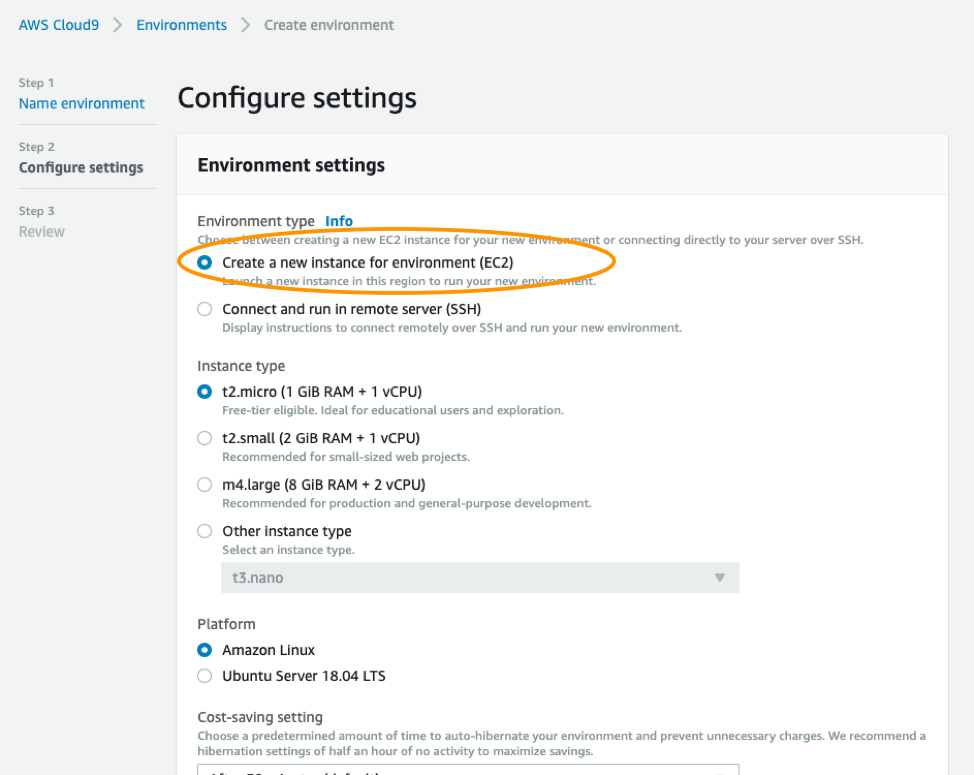
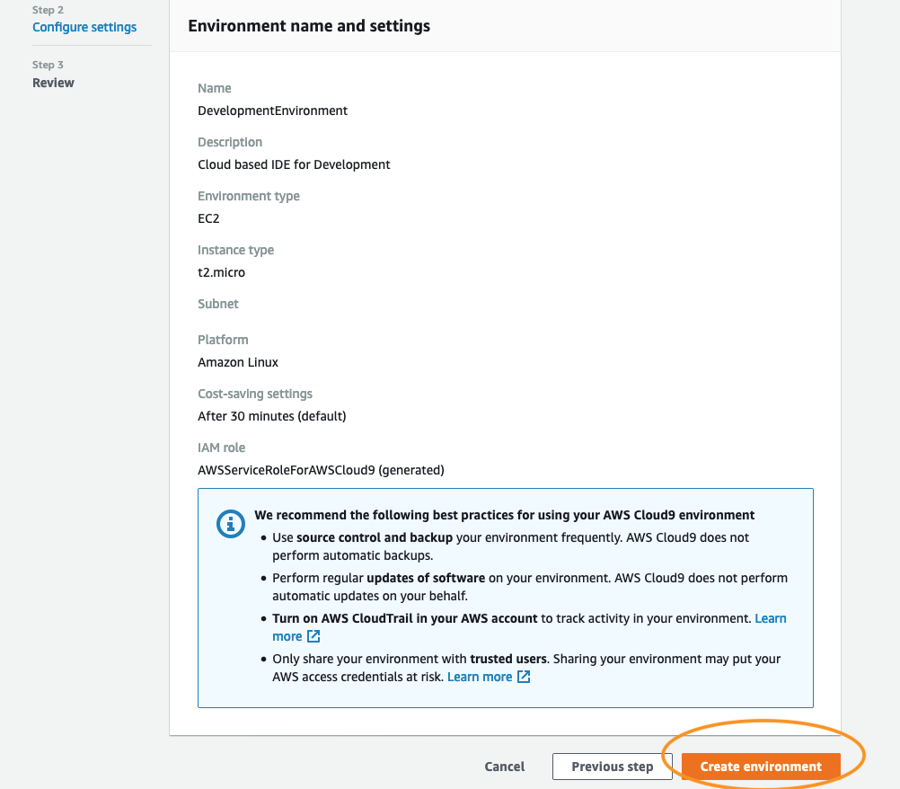
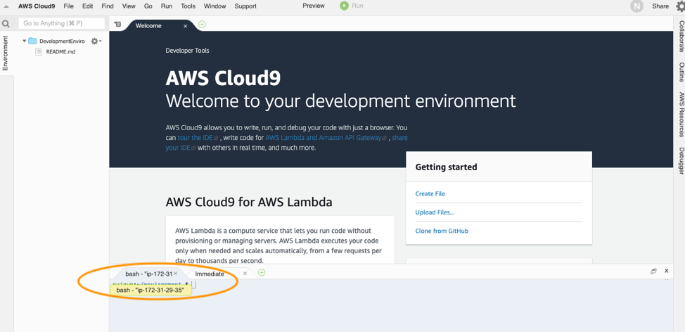

## Setps to setup Cloud9 Environment

**Step 1.**

Login to AWS Console and search for Cloud9 Service on the home page

**Step 2.**

Create New Cloud9 Environment

**Step 3.**

Provide the details for creating new environment

**Step 4.**

Configure and Use Default Settings for Cloud9 Environment and Click on **Next Step** button

**Step 5.**

Click on **Create Environment** button 

**Step 6.**

It will take couple of minutes to create the environment, Below screen appears once done.

Note that the terminal highlighted will be used for executing the code in the next steps.

You have created Cloud9 Environment. Go back to [PreviousPage](../README.md)

